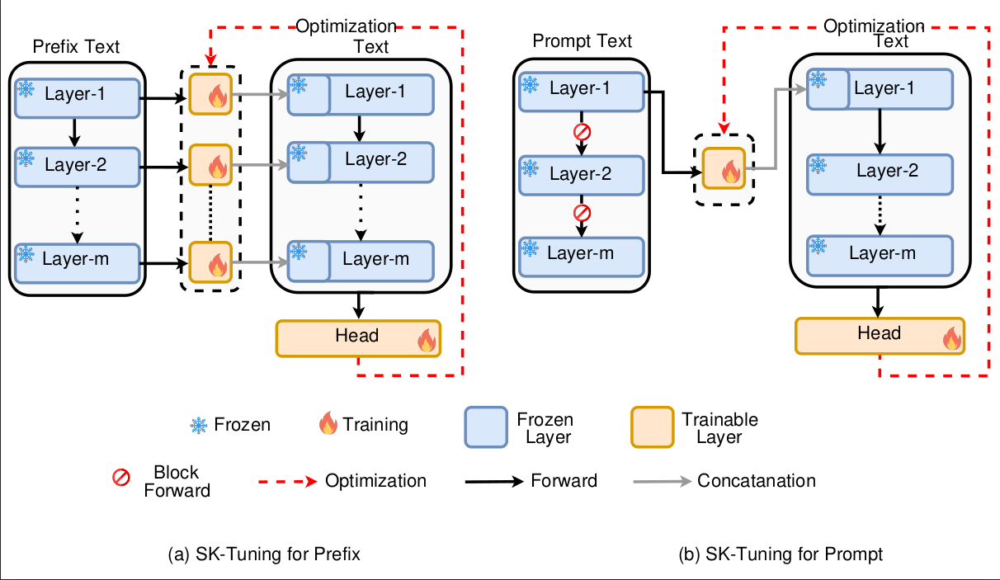

#  Parameter-Efficient Fine-Tuning of Large Language Models using Semantic Knowledge Tuning

## Abstract
In recent years, fine-tuning Large Language Models (LLMs) for specific downstream tasks using prompts and prefixes has
gained considerable attention in Natural Language Processing (NLP) research due to its computational efficiency. However,
conventional methods for prompt and prefix tuning often rely on trainable virtual tokens within an adapter, while the core
LLM parameters remain fixed. These virtual tokens lack inherent semantic meaning, necessitating extensive training to
acquire task-specific knowledge and leading to suboptimal performance. In this paper, we introduce Semantic Knowledge
Tuning (SK-Tuning) as an innovative approach to enhance the efficient fine-tuning of LLMs within the context of prefix and
prompt tuning. In contrast to traditional methods that employ arbitrary virtual tokens, SK-Tuning harnesses real, semantically
meaningful prompt or prefix text for adapter training. Our method adopts an approach, wherein one frozen LLM is employed to
extract the semantic information from the prefix or prompt. This information is subsequently refined through a trainable adapter.
Following this, the same frozen LLM is utilized to obtain embeddings of the input text alongside the prefix or prompt embedding.
The resulting combined embedding is fine-tuned for downstream tasks. By leveraging the LLM’s innate ability to comprehend
the meaning of prompt or prefix text, in conjunction with its zero-shot capabilities, SK-Tuning exhibits rapid convergence during
training and significantly enhances task performance. Experimental results showcased in this study highlight the superiority
of SK-Tuning over traditional parameter fine-tuning approaches in terms of efficiency, effectiveness, training speed, and the
number of trainable parameters. We conduct extensive experiments across a spectrum of downstream tasks, encompassing
sequence classification, token classification, and Natural Language Inference (NLI). Additionally, we provide comparative
analyses between SK-Tuning and other parameter-efficient methods, such as prompt tuning, prefix tuning, p-tuning, and
lora. These findings underscore SK-Tuning’s potential as a potent tool for elevating LLM performance while maintaining high
parameter efficiency, thus contributing to the advancement of the NLP field with more efficient and effective applications.


### Methodology
The SK-Tuning method figure is shown below:

> Figure 1. SK-Tuning approaches for Prefix (left) and Prompt (right). The <span style="color:red">dashed line</span> represents the optimization path during
the backward pass to the trainable adapter. Notably, in the context of prompt-tuning (on the right), the The <span style="color:red">no sign</span> signifies the
discontinuation of the forward pass beyond a certain point. This is because we exclusively initialize layer-specific semantic
information for the prompt, rendering the continuation of the forward pass unnecessary for the remaining layer


### Setup
We conduct our experiment with Anaconda3. If you have installed Anaconda3, then create the environment for P-tuning v2:

```shell
conda create -n ST python=3.10.12
conda activate ST
```

After we setup basic conda environment, install pytorch related packages via:

```shell
conda install pytorch torchvision torchaudio pytorch-cuda=11.8 -c pytorch -c nvidia
```

Finally, install other python packages we need:

```shell
pip install -r requirements.txt
```
